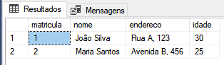
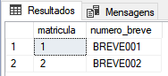

# SISTEMATIZAÇÃO – MODELAGEM DE DADOS

Contexto: 

Num aeroclube, estão inscritos pilotos, instrutores e alunos de pilotagem. Todos sócios (inscritos) são  identificados pelo número de matrícula, e caracterizados por nome, endereço e idade. Os pilotos possuem  um número de brevê (único). Os instrutores são pilotos com formação adicional de instrutor, e deve ser  registrado o nome do curso, a data de obtenção do diploma, bem como a instituição. Para os alunos de  pilotagem, guarda-se os registros de todas suas saídas para contabilização de horas para obtenção do  brevê. Para cada saída registra-se a data, instrutor, hora de saída de chegada, bem como o parecer do  instrutor sobre o voo. A escola só ministra cursos básicos e, portanto, não há professores que são alunos  de cursos avançados. Para emissão do brevê, é necessário que o aluno comprove ter o número de horas  mínimo de voo, bem como apresente os pareceres dos instrutores sobre as habilidades desenvolvidas a  cada aula prática. Com base na breve especificação da situação problema, desenvolva o que se pede a seguir: 

1) Realize um modelo de dados conceitual que contemple a necessidade de armazenamento de dados. 
2) Transforme o modelo de dados conceitual em modelo de dados físico, resolvendo os problemas de  relacionamento entre entidades. 

3) Garanta que seu modelo físico está na 3 forma normal. 
4) Crie os comandos de criação dos objetos de banco baseado na Linguagem de Definição de Dados  (DDL). 

5) Crie comandos de inserção de linhas nas tabelas criadas (pelo menos duas linhas por tabela) baseado  na Linguagem de Manipulação de Dados (DDL).

### 1. Modelo de Dados Conceitual

#### Entidades

- Socio (matricula, nome, endereco, idade)
- Piloto (matricula, numero_breve)
- Instrutor (matricula, nome_curso, data_diploma, instituicao)
- Aluno (matricula, numero_breve)
- Saida (matricula_aluno, data, instrutor, hora_saida, hora_chegada, parecer_instrutor)

#### Relacionamentos

- Socio é pai de Piloto (1:N)
- Socio é pai de Instrutor (1:N)
- Socio é pai de Aluno (1:N)
- Piloto é filho de Socio (1:1)
- Instrutor é filho de Socio (1:1)
- Aluno é filho de Socio (1:1)
- Aluno possui várias Saídas (1:N)
- Instrutor ministra várias Saídas (1:N)


### 2. Modelo de Dados Físico

#### Tabelas:

- Socio (matricula, nome, endereco, idade)
  - PK: matricula
- Piloto (matricula, numero_breve)
  - PK: matricula
  - FK: matricula (Socio)
- Instrutor (matricula, nome_curso, data_diploma, instituicao)
  - PK: matricula
  - FK: matricula (Socio)
- Aluno (matricula, numero_breve)
  - PK: matricula
  - FK: matricula (Socio)
- Saida (matricula_aluno, data, instrutor, hora_saida, hora_chegada, parecer_instrutor)
  - PK: matricula_aluno, data
  - FK: matricula_aluno (Aluno)

### 3. Modelo físico na 3ª forma normal

* O modelo físico já está na 3ª Forma Normal, pois todas as dependências funcionais entre as colunas foram tratadas na definição das tabelas.

### 4. Comandos de criação dos objetos de banco (DDL):

````sql
CREATE DATABASE aeroclube;

USE aeroclube;

CREATE TABLE Socio (
    matricula INT PRIMARY KEY,
    nome VARCHAR(50),
    endereco VARCHAR(100),
    idade INT
);

CREATE TABLE Piloto (
    matricula INT PRIMARY KEY,
    numero_breve VARCHAR(20),
    FOREIGN KEY (matricula) REFERENCES Socio (matricula)
);

CREATE TABLE Instrutor (
    matricula INT PRIMARY KEY,
    nome_curso VARCHAR(50),
    data_diploma DATE,
    instituicao VARCHAR(100),
    FOREIGN KEY (matricula) REFERENCES Socio (matricula)
);

CREATE TABLE Aluno (
    matricula INT PRIMARY KEY,
    numero_breve VARCHAR(20),
    FOREIGN KEY (matricula) REFERENCES Socio (matricula)
);

CREATE TABLE Saida (
    matricula_aluno INT,
    data DATE,
    instrutor VARCHAR(50),
    hora_saida TIME,
    hora_chegada TIME,
    parecer_instrutor VARCHAR(200),
    PRIMARY KEY (matricula_aluno, data),
    FOREIGN KEY (matricula_aluno) REFERENCES Aluno (matricula)
);

````

### 5. Comandos DML para inserção de linhas nas tabelas:

````sql
-- Inserção na tabela Socio
INSERT INTO Socio (matricula, nome, endereco, idade)
VALUES (1, 'João Silva', 'Rua A, 123', 30),
       (2, 'Maria Santos', 'Avenida B, 456', 25);

-- Inserção na tabela Piloto
INSERT INTO Piloto (matricula, numero_breve)
VALUES (1, 'BREVE001'),
       (2, 'BREVE002');

-- Inserção na tabela Instrutor
INSERT INTO Instrutor (matricula, nome_curso, data_diploma, instituicao)
VALUES (1, 'Curso de Instrutor A', '2022-01-01', 'Instituição A'),
       (2, 'Curso de Instrutor B', '2022-02-01', 'Instituição B');

-- Inserção na tabela Aluno
INSERT INTO Aluno (matricula, numero_breve)
VALUES (1, 'BREVE003'),
       (2, 'BREVE004');

-- Inserção na tabela Saida
INSERT INTO Saida (matricula_aluno, data, instrutor, hora_saida, hora_chegada, parecer_instrutor)
VALUES (1, '2022-01-01', 'Instrutor A', '09:00:00', '11:00:00', 'Voo bem-sucedido'),
       (2, '2022-02-01', 'Instrutor B', '14:00:00', '16:00:00', 'Excelente progresso');
````

````sql
SELECT * FROM Socio
````



````SQL
SELECT * FROM Piloto
````



`````SQL
SELECT * FROM Instrutor
`````


````sql
SELECT * FROM Aluno
````


````SQL
SELECT * FROM Saida
````


